## Procedure

- Measure the velocity and the static pressure in the duct without Evasee.
- Measure the velocity and static pressure after putting the Evasee.
- The velocity is measured using anemometer and static pressure using DPCal.
- The performance is calculated using the following formula:

## Simulation Procedure
#### Procedure to run the Simulator:

1. Enter the Radius of the Duct in the given box..the range is 0.5 to 0.6.

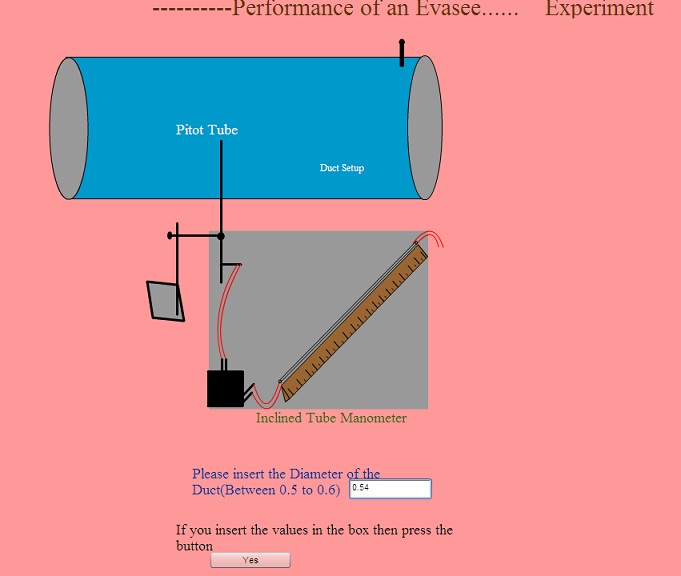

2. Then Press the button "Yes" if you input the radius of the duct in the given box.

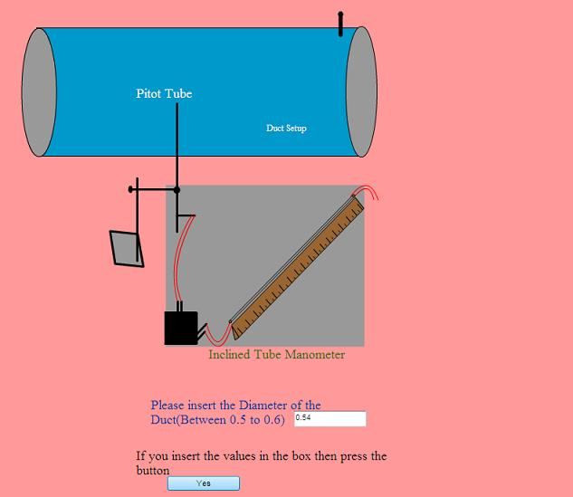

3. Then click on the button "Anemometer Traversing" Traversing the anemometer and get the air velocity and static pressure from the pitot static tube without Evasee.

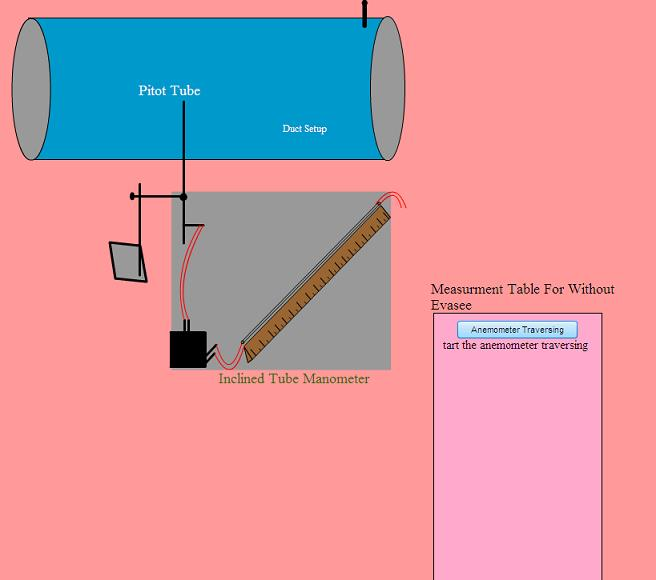

4. Then Click on the button "Velocity Reading1" to find out the 1st reading of the air velocity.

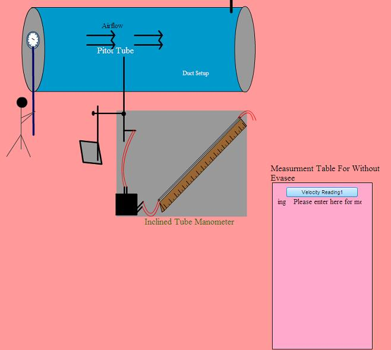

5. Then go for the second reading by clicking the button "Velocity Reading2"

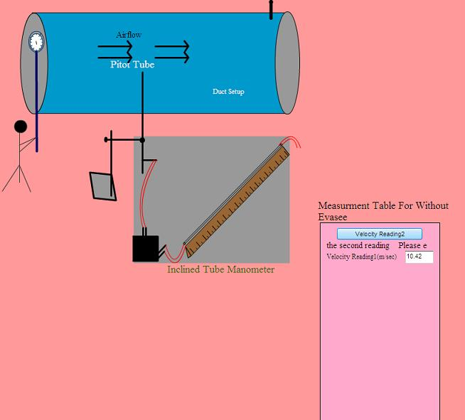

6. Then go for the third one, same procedure.

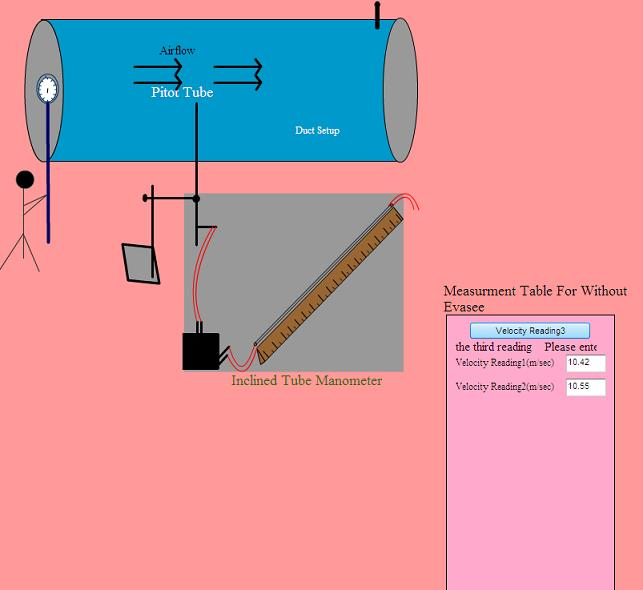

7. After that click on the button "Measure" to calculate the static pressure, avg velocity and quantity of air.

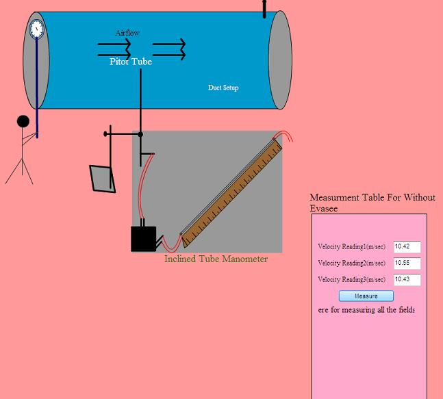

8. Then press the button for measuring the air velocity, static pressure and quantity of air flow with evasee "Measure with Evasee".

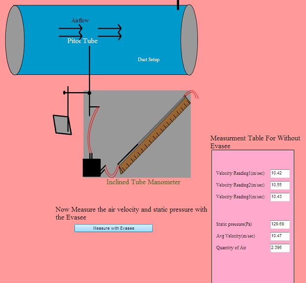

9. Then press the button "Anemometer Traversing" Traversing the anemometer for measuring the air velocity with evasee.

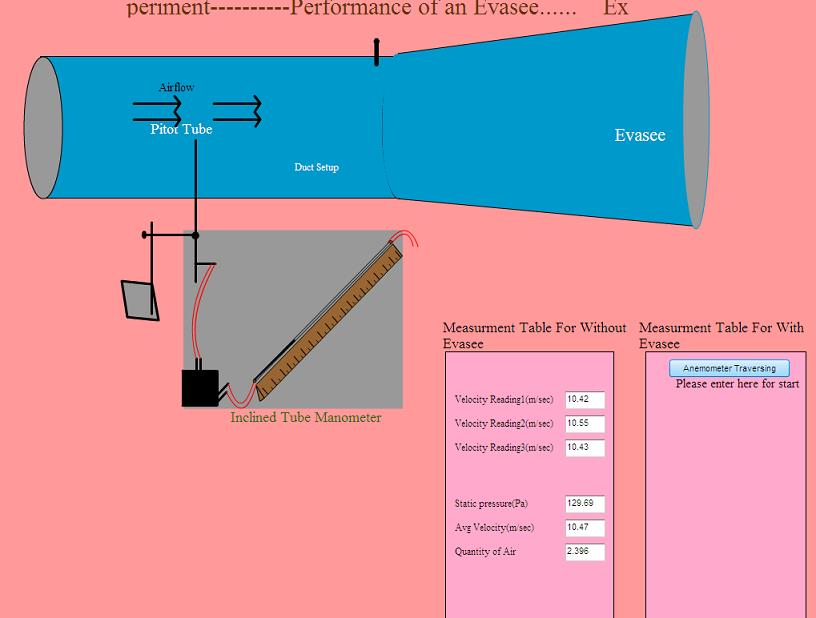

10. Then press the button to measuring the Air velocity as same as the without evasee.

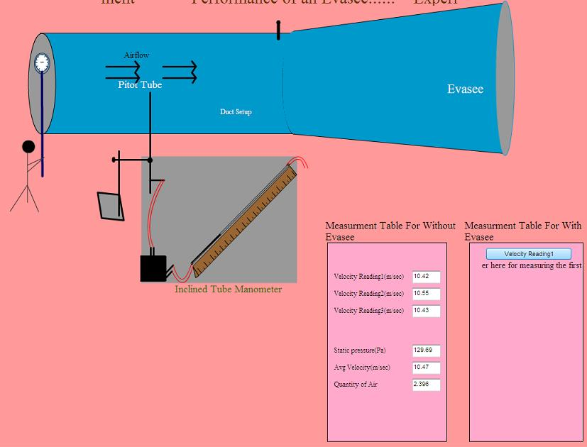

11. Then measure the Static pressure, avg velocity and the quantity of air flow by clicking the button "Measure".

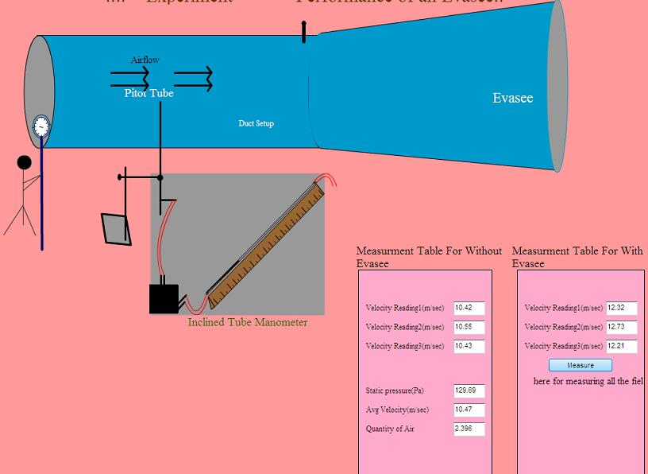

12. Then press the button "Calculate" the to calculate the efficiency of the evasee and increase in quantity of air.

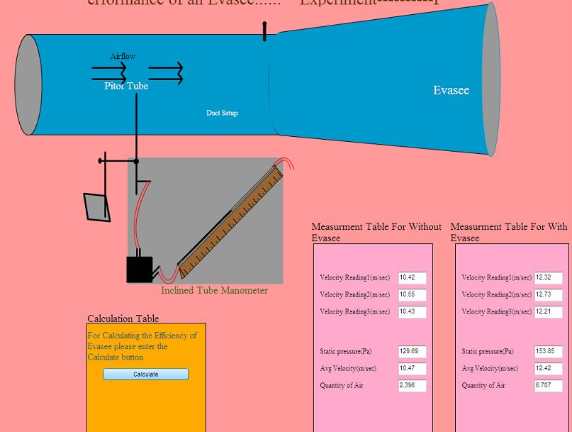

13. Efficiency of the Evasee and the Increase in the Air quantity is.

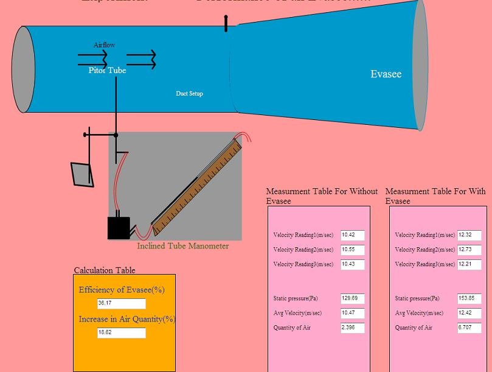
