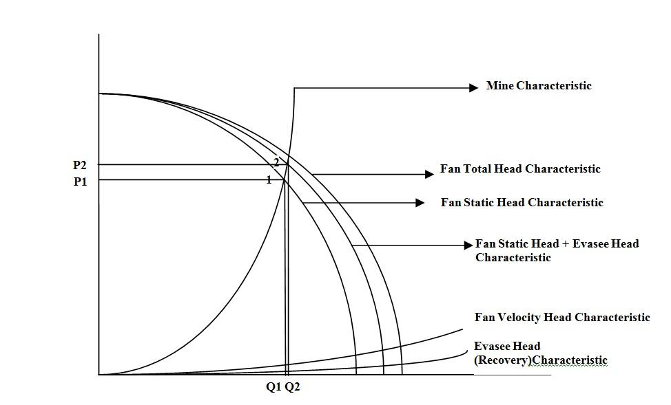

## Theory

An Evasee is a device which is usually attached at the outlet of the mine fan to recover some of the wasteful energy to the useful pressure energy. This recovered pressure energy in turn increases the air flow rate in the mine ventilation system. Basically an Evasee is a gradually expanding conical frustum which converts a part of the kinetic energy to static energy by virtue of its area change (increase in area) between inlet to outlet.

The functional benefit of an Evasee can be realized if the figure 1, which depicts performance characteristics curves of mine ventilation systems with and without Evasee, is consulted. In absence of Evasee, the fan operates at the static pressure P1 and quantity Q1. When the Evasee is added to the system, the static pressure increases to P2 and a result of which quantity increases to Q2. However, total pressure energy (static + kinetic) remains same for both of the cases. Therefore, with same power consumption extra quantity is added to the systems with the help of an Evasee.

Ideally, full conversion of the expected kinetic pressure energy to static pressure energy is not achieved due to shock losses and friction losses (due to extra length of Evasee in the system). The increase in area should be gradual and symmetrical to minimize the shock losses. In this respect, a suitable angle of divergence of the sides of the Evasee is to be maintained. Smaller angle makes the Evasee too long and expensive as well as long Evasee increases frictional pressure losses. On the other hand, larger angle of divergence increases the shock loss in the Evasee. Hence in order to realize optimum pressure head recovery of an Evasee, it should be constructed suitably. In this experiment, the Evasee with a divergence angle of 7° and area ratio of 4:1 is used. The efficiency of this Evasee is now needed to be evaluated through laboratory experiment.

								
								
Figure 1: Effect of an Evasee on the performance of a mine fan

Hence, if  V1 = velocity of air at fan outlet (Evasee inlet) and V2 = velocity of air at the Evasee outlet, the static head h recovered by the Evasee is given by the relation:

$$ h= (\frac{v_1^2-v_2^2}{2g})\eta $$

Where η efficiency of head recovery in the Evasee.

 
## Apparatus used:
The required instruments in this experiment are given below
- Anemometer
- Measuring tape
- Differential pressure measuring device (D.P. Cal, Manometer)

## Instruments
1. Evasee
2. Anemometer
3. Air duct
4. Measuring tape
5. D.P calculator

## Demo

<!-- blank line -->
<figure class="video_container">
  <iframe src="https://www.youtube.com/embed/GT4Ru7kDeAY" frameborder="0" allowfullscreen="true"> </iframe>
</figure>
<!-- blank line --> 

